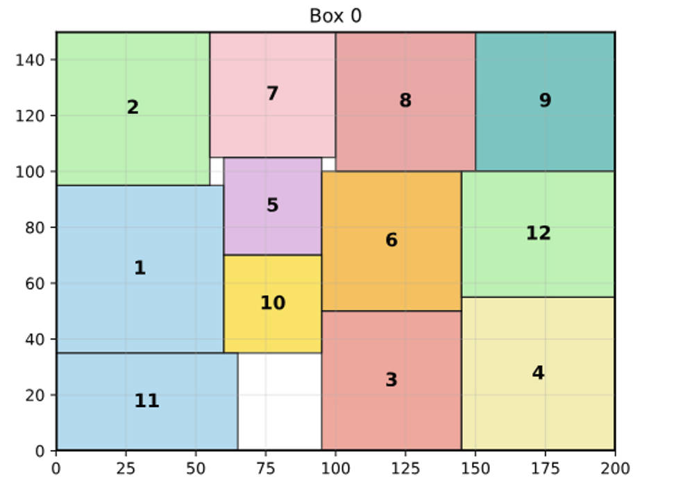
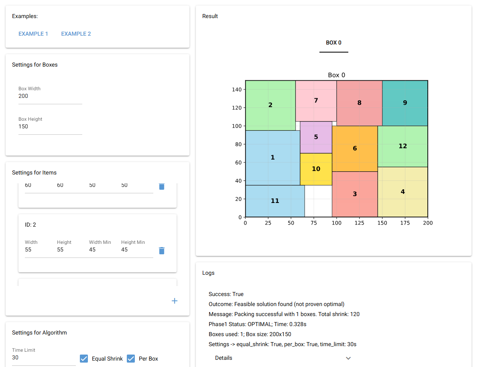

# scalable-rectpack

---

## Scalable 2D Rectangle Packing

This project presents a robust and flexible solution to the 2D bin packing problem, focusing on efficient space optimization. It leverages advanced constraint programming to pack rectangles of varying sizes into bounded areas, aiming to minimize wasted space. Beyond the powerful core library, `scalable-rectpack` also offers an intuitive web-based application to visualize and interact with packing solutions in real-time.

<div align="center">

[](https://github.com/MilkMilkMilky/scalable-rectpack/blob/main/LICENSE)
[](https://github.com/MilkMilkMilky/scalable-rectpack/commits/main)
[](https://github.com/MilkMilkMilky/scalable-rectpack)

</div>



<div align="center">
    <a href="https://github.com/MilkMilkMilky/scalable-rectpack">Github</a>
</div>

## Overview

The Scalable 2D Rectangle Packing Tool is a comprehensive solution for the 2D bin packing problem, combining powerful optimization algorithms with an intuitive web-based visualization interface. This project demonstrates advanced constraint programming techniques to efficiently pack rectangles of varying sizes into bounded areas while minimizing wasted space.

### Why `scalable-rectpack`?

-   **🚀 High Performance**: Built upon Google OR-Tools CP-SAT solver, our library delivers state-of-the-art optimization capabilities for even the most complex packing scenarios.
-   **🎨 Interactive Visualization**: Explore solutions with a rich, real-time web interface powered by NiceGUI, making it easy to understand and debug packing strategies.
-   **⚙️ Flexible Configuration**: Tailor the algorithm to your needs with options for equal or independent dimension shrinking, and choose between per-box or global optimization strategies.
-   **📊 Real-time Insights**: Monitor the optimization process with live execution logs and performance metrics, giving you clear visibility into how solutions are found.
-   **🔧 Seamless Integration**: Whether you prefer a programmatic approach with our Python API or interactive exploration via the web interface, `scalable-rectpack` offers versatile tools for researchers, developers, and practitioners alike.

## Core Library Features

Our library is designed to be both scalable and adaptable, offering:

-   📏 **Scalable & Flexible**: Handles rectangles with adjustable dimensions and constraints, adapting to diverse packing requirements.
-   ⚡ **Optimization-Driven**: Focuses on minimizing wasted area while guaranteeing feasible placement within containers.
-   🧩 **General-Purpose**: Applicable across various domains, including layout design, photo walls, cutting stock, and game level design.
-   🎯 **Dual-Phase Optimization**: Employs a unique two-phase approach: first minimizing the number of boxes, then optimizing item shrinkage for maximum efficiency.
-   🔧 **Configurable Parameters**: Offers fine-grained control over algorithm behavior, including time limits, equal shrink options, and per-box optimization.
-   📈 **Performance Monitoring**: Provides detailed execution logs and optimization status tracking for deep insights into the solving process.

## Installation

### Core Package
To install the core package, run the following command:

```bash
python -m pip install git+https://github.com/MilkMilkMilky/scalable-rectpack.git
```

Or install from local:

```bash
git clone https://github.com/MilkMilkMilky/scalable-rectpack.git
cd scalable-rectpack
python -m pip install .
```

### Web Application (Optional)
To install with web visualization capabilities:

```bash
python -m pip install "scalable-rectpack[visual]"
```

Or from local with visual dependencies:

```bash
git clone https://github.com/MilkMilkMilky/scalable-rectpack.git
cd scalable-rectpack
python -m pip install ".[visual]"
```

## Getting Started

### Option 1: Python API (For Developers)

The `scalable-rectpack` library provides a powerful Python API for integrating 2D rectangle packing optimization into your projects.

1.  **Install the core package:**
    ```bash
    python -m pip install scalable-rectpack
    ```

2.  **Run a basic example:**
    ```python
    from scalable_rectpack._core import Item, solve_scalable_rectpack

    # Define items to be packed
    items = [Item(id=1, width=120, height=80, width_min=100, height_min=60)]
    
    # Define the container (box) size
    box_width, box_height = 200, 150

    # Solve the packing problem
    result = solve_scalable_rectpack(items, box_width=box_width, box_height=box_height)

    if result.success:
        print(f"Packing successful! Boxes used: {result.num_boxes_used}")
        for box_res in result.packing_results:
            if box_res.packed_items:
                for p in box_res.packed_items:
                    print(f"  Item {p.id} packed at ({p.x},{p.y}) with size {p.width}x{p.height}")
    else:
        print(f"Packing failed: {result.message}")
    ```

### Option 2: Web Application (For Interactive Exploration)

For a hands-on, interactive experience, you can use the bundled web application demo. This is ideal for quickly visualizing packing solutions and experimenting with different parameters without writing code.

1.  **Install with visualization support:**
    ```bash
    python -m pip install "scalable-rectpack[visual]"
    ```

2.  **Launch the web application:**
    ```bash
    rectpack-visual
    ```

3.  **Open your browser** and navigate to `http://localhost:8080` to start exploring.

## Usage

### Quick start

```python
from scalable_rectpack._core import Item, solve_scalable_rectpack, PackingOutcome

# 1) Define items (original size and minimum allowed size)
items = [
    Item(id=1, width=120, height=80,  width_min=100, height_min=60),
    Item(id=2, width=90,  height=110, width_min=70,  height_min=90),
    Item(id=3, width=60,  height=60,  width_min=50,  height_min=50),
]

# 2) Define box size
box_width, box_height = 200, 200

# 3) Solve. Recommended defaults for speed: equal_shrink=True, per_box=True
result = solve_scalable_rectpack(
    items=items,
    box_width=box_width,
    box_height=box_height,
    equal_shrink=True,    # shrink equally in both dimensions (faster in practice)
    per_box=True,         # optimize shrink per physical box (faster to optimal)
    time_limit=30,
)

if not result.success:
    print(f"Failed: {result.outcome.value}. {result.message}")
else:
    print(f"Boxes used: {result.num_boxes_used}; outcome: {result.outcome.value}")
    for box_res in result.packing_results:
        if box_res.packed_items:
            print(f"Box {box_res.box_id if box_res.box_id is not None else 'GLOBAL'}: shrink={box_res.total_shrink}")
            for p in box_res.packed_items:
                print(f"  item {p.id} -> box {p.box_id}, pos=({p.x},{p.y}), size={p.width}x{p.height}")

```

### Concepts and parameters

- **Items and box**: You provide a list of `Item(id, width, height, width_min, height_min)` and a single box size `(box_width, box_height)`. The solver decides how many boxes are needed and where each item is placed.

- **Two-phase optimization**:

  - **Phase 1 (minimize box count)**: The solver first minimizes the number of boxes needed to pack all items without overlap.
  - **Phase 2 (minimize shrink)**: Given the minimum number of boxes from Phase 1, the solver minimizes the total shrink of items.

- **equal_shrink: bool**

  - `True` (recommended default): Each rectangle’s width and height shrink by the same amount. Squares remain squares after shrinking.
  - `False`: Width and height can shrink independently within their allowed ranges.

- **per_box: bool**

  - `True` (recommended default): Phase 2 optimizes shrink separately for each box using the items assigned in Phase 1. Faster to reach optimality. Because Phase 1 only minimizes box count and may assign items differently across runs, the final per-box total shrink can vary between runs.
  - `False`: Phase 2 performs a global optimization across all boxes while keeping the number of boxes at the Phase 1 minimum. This yields a deterministic total shrink when the result is optimal. However, it may take much longer to prove optimality; you may see feasible (but not proven optimal) solutions for tens of seconds or even minutes.

- **time_limit: int (seconds)**
  - Limits the OR-Tools CP-SAT solver wall time per phase/solve. If the optimal solution is not proven within the limit, a feasible solution (if found) is returned with outcome `FEASIBLE`.
  - If you already have a feasible solution and want to try to reach optimality, increase `time_limit`.

### API reference (core)

```python
from scalable_rectpack._core import Item, solve_scalable_rectpack, PackingResult

result: PackingResult = solve_scalable_rectpack(
    items: list[Item],
    box_width: int,
    box_height: int,
    equal_shrink: bool = False,
    per_box: bool = False,
    time_limit: int = 30,
)
```

- **Return value**: `PackingResult` contains
  - `success: bool`
  - `outcome: PackingOutcome` – `OPTIMAL`, `FEASIBLE`, or a no-solution status
  - `message: str`
  - `num_boxes_used: int | None`
  - `status_phase1: CpSolverStatus`, `solve_time_phase1: float`
  - `box_width: int`, `box_height: int`
  - `packing_results: list[PerBoxPackingResult]`

Each `PerBoxPackingResult` contains:

- `box_id: int | None` (None for global result when `per_box=False`)
- `packed_items: list[PackedItem] | None`
- `total_shrink: int | None`
- `status: CpSolverStatus`, `solve_time: float`, `outcome: PackingOutcome`, `message: str | None`

Each `PackedItem` contains: `id, x, y, width, height, box_id`.

### Examples

1. Equal shrink to keep squares square

```python
result = solve_scalable_rectpack(
    items=items,
    box_width=200,
    box_height=200,
    equal_shrink=True,   # width and height shrink equally
    per_box=True,
    time_limit=20,
)
```

2. Global optimization across boxes (deterministic total shrink when optimal)

```python
result = solve_scalable_rectpack(
    items=items,
    box_width=200,
    box_height=200,
    equal_shrink=False,
    per_box=False,       # global Phase-2
    time_limit=120,      # allow more time to prove optimality
)
```

3. Faster per-box optimization (final shrink may vary between runs)

```python
result = solve_scalable_rectpack(
    items=items,
    box_width=200,
    box_height=200,
    equal_shrink=False,
    per_box=True,        # per-box Phase-2
    time_limit=15,
)
```

### Practical tips

- Start with `per_box=True` for faster high-quality results. Switch to `per_box=False` and raise `time_limit` if you need globally optimal shrink.
- If some items’ minimum size exceeds the box size, the solver raises `ValueError`.
- For large instances, consider increasing `time_limit`.
- For speed in most cases, prefer `equal_shrink=True` and `per_box=True`.

## Web Application Demo

The `scalable-rectpack` project includes an interactive web application that serves as a powerful demo and exploration tool for the core library's capabilities. Built with [NiceGUI](https://nicegui.io/), this demo provides a real-time visualization of rectangle packing solutions, allowing you to easily experiment with different settings and immediately see the results.

### Why use the Web Application?

-   **Visual Insight**: See how rectangles are packed into boxes in an intuitive graphical interface.
-   **Interactive Experimentation**: Adjust box dimensions, add/remove items, and fine-tune algorithm parameters on the fly.
-   **Real-time Feedback**: Observe optimization progress and detailed logs as the solver works.
-   **User-Friendly**: No coding required to get started – simply launch and explore.

### Key Features of the Web Interface

The web application is divided into two main panels to give you full control and visibility:

#### **Left Panel - Configuration & Controls**

This panel allows you to define your packing problem:

-   **📋 Examples**: Quickly load predefined scenarios to understand various packing challenges.
-   **📦 Box Settings**: Easily set the width and height of your packing containers.
-   **📏 Item Management**: Dynamically add, remove, and modify the dimensions (width, height, minimum width, minimum height) of individual items.
-   **⚙️ Algorithm Settings**: Adjust core solver parameters:
    -   `Time Limit`: Control the maximum time the optimizer spends searching for a solution.
    -   `Equal Shrink`: Toggle whether items must shrink proportionally (maintaining aspect ratio).
    -   `Per Box Optimization`: Decide if the shrinking phase should optimize per box or globally.

#### **Right Panel - Live Results & Visualization**

This panel displays the outcome of your packing problem:

-   **📊 Interactive 2D Visualization**: A dynamic plot shows the arrangement of packed rectangles within the boxes. Each item is color-coded and labeled for clear identification. Supports multi-box layouts with easy tab navigation.
-   **📝 Detailed Execution Logs**: Get a comprehensive summary of the optimization process, including:
    -   Success status and outcome (e.g., Optimal, Feasible).
    -   Messages from the solver.
    -   Time taken for each optimization phase.
    -   Total shrink achieved and the settings used.

### Web Application Screenshot



*A glimpse of the web interface, demonstrating a successful packing solution with multiple items in a 200x150 box. The interactive controls on the left allow for real-time adjustments, while the right panel displays the visual result and detailed logs.*

## License

This project is licensed under the MIT license.
Check the [LICENSE](LICENSE) file for more details.

## Contributing

Please follow the [Contributing Guide](https://github.com/MilkMilkMilky/scalable-rectpack/blob/main/CONTRIBUTING.md) to contribute to this project.

## Contact

For support or inquiries, please contact:

- Email: milkcowmilky@gmail.com
